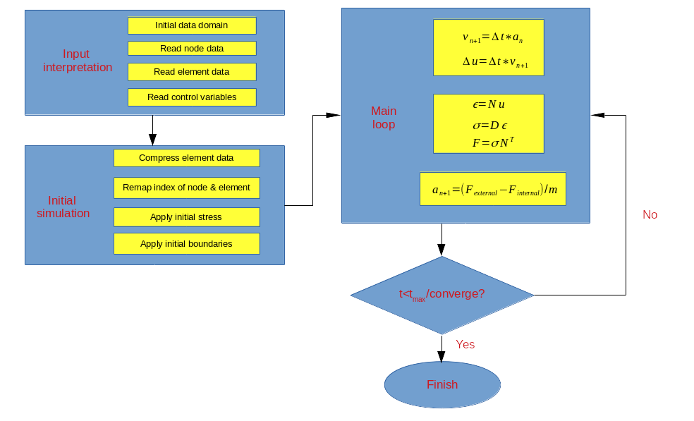

# Summary

Rock dynamics has become one of the most important topics in the field of rock mechanics and rock engineering. The spectrum of rock dynamic behavior widely includes phenomena of rockbursting, spalling, popping, collapse, toppling, sliding, and so on, which is induced by the stress redistribution and energy release after excavation [@aydan2017rock]. Current version of rdbsp aims to simulate the process of displacement field redistribution and stress wave propagation in deep underground rock with finite element method[@WANG201547]. Forward Euler time integration scheme is adapted in this program to simulate the dynamic procedure [@Ascher1994]. The elastic constitutive model and Mohr-Coulomb plastic model are implemented in this version [@ottosen2005mechanics]. 

To speed up the simulation as well as to overcome the over-stiff effect of fully integrated element during dynamic simulation [@zienkiewicz2013finite], three-dimensional solid element type with a single integration point is implemented. Zero energy modes, so called hourglass effect could happen for the single point integrated element, the hourglass resistance is applied to eliminate that effect [@nme1620170504]. The Jaumann derivative is added into the program with the concern of the effect of the rigid body rotation to solve the difficulty of the large deformation calculation for the deep rock mass [@VALANIS1990353]. For dynamic analysis, Rayleigh damping and artificial viscosity are also available to control damping. With local nonviscous damping rdbsp could also obtain the static results of a rock mass excavation [@CUNDALL10003877143]. The convergence of the system to a steady state is controlled by the ratio of total unbalance force and nodal mass. The finite element model can be generated by the Hypermesh via the template of DYNA3D with minor change. The results of simulation could be exported for Paraview [@Kitware]and Tecplot [@Tecplot].

rdbsp is a fully functional simulation program with modules for input file interpretation, memory management, and node/element index remapping. The working flow of rdbsp is shown in in the following figure. The input file for a sample test of quarter symmetrical circle tunnel excavation project is included in source file.

# Acknowledgement
Supported by "the Fundamental Research Funds for the Central Universities"(No. 30917011337) and "the Program of China Scholarships Council" (No. 201806845032)

# References
